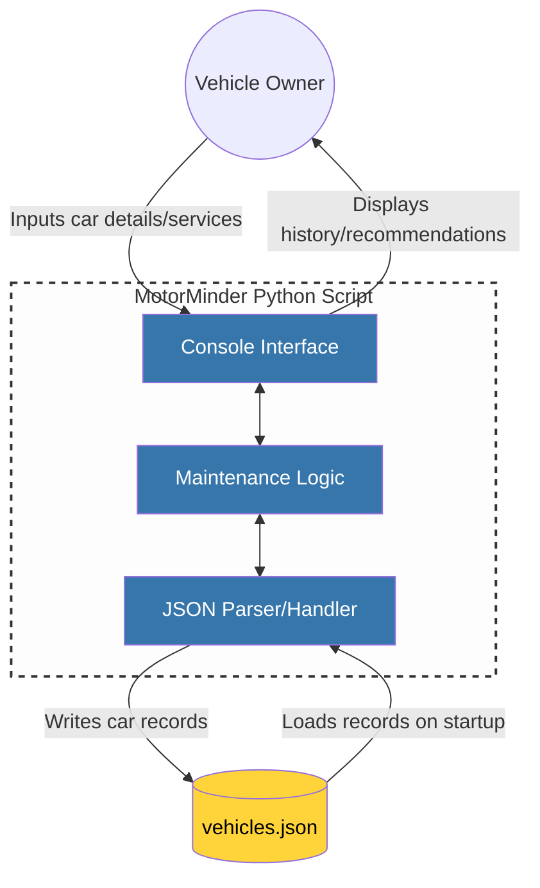

# MotorMinder Architecture Documentation

## Level 1: System Context Diagram (MVP)

This diagram follows the **C4 Model** for software architecture, representing the highest level of abstraction. It illustrates how the **MotorMinder** application interacts with the user and the local environment.

### Project Scope
For the Minimum Viable Product (MVP), the system is implemented as a **Console-Based Python Application**. To ensure simplicity and portability during initial development, the system relies on local JSON persistence rather than external database servers or cloud APIs.

